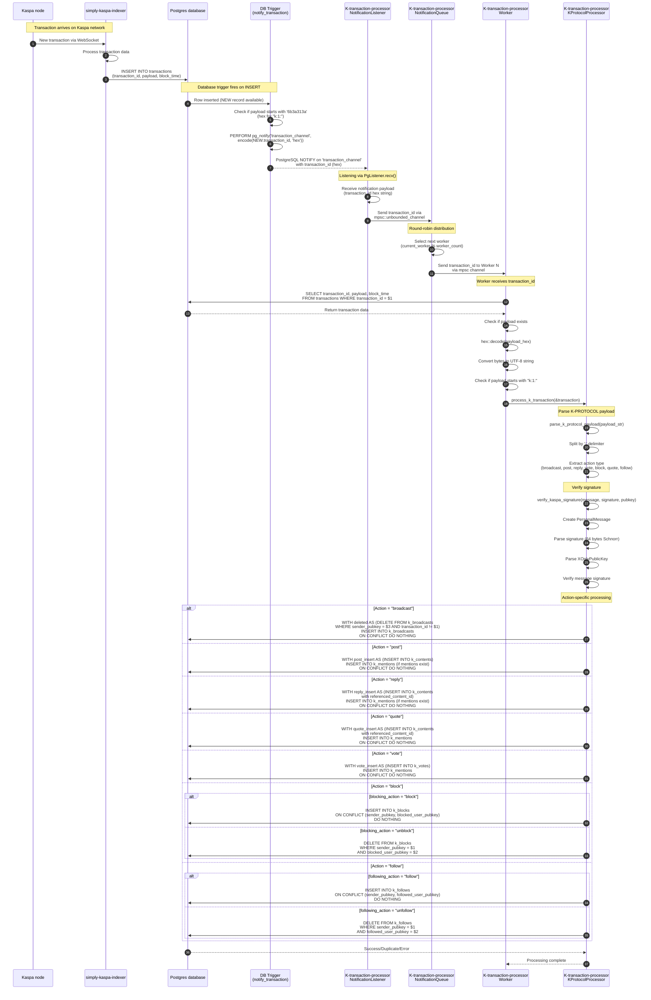

# K-Protocol Transaction Processing Flow

This document describes the complete flow of a K-PROTOCOL transaction from the moment it arrives on the Kaspa network until it's processed and stored in the database.

## Overview

The K-indexer system processes K-PROTOCOL transactions using the following main components:
- **Kaspa node**: Source of blockchain transactions
- **simply-kaspa-indexer**: Indexes all Kaspa transactions into PostgreSQL
- **Postgres database**: Stores transaction data and K-protocol content
- **K-transaction-processor**: Processes K-PROTOCOL transactions specifically

## Sequence Diagram



## Detailed Flow Description

### 1. Transaction Arrival (Steps 1-3)
- A new transaction arrives on the Kaspa network
- The Kaspa node sends it to simply-kaspa-indexer via WebSocket connection
- simply-kaspa-indexer processes and inserts the transaction into the `transactions` table with fields:
  - `transaction_id` (bytea)
  - `payload` (bytea)
  - `block_time` (bigint)

**Code Reference:** [compose.yaml:24](docker/DEV/compose.yaml#L24)

### 2. Database Trigger Activation (Steps 4-6)
- PostgreSQL trigger `notify_transaction()` fires on INSERT
- Checks if payload starts with `6b3a313a` (hex encoding of "k:1:")
- If match found, executes `pg_notify('transaction_channel', encode(NEW.transaction_id, 'hex'))`

**Code Reference:** [database.rs:172-199](K-transaction-processor/src/database.rs#L172-L199)

### 3. Notification Routing (Steps 7-10)
- **NotificationListener** listens on PostgreSQL channel `transaction_channel` via `PgListener`
- Receives notification payload containing transaction_id (hex string)
- Sends transaction_id through unbounded MPSC channel to NotificationQueue
- **NotificationQueue** distributes work to workers using round-robin algorithm

**Code References:**
- [listener.rs:20-88](K-transaction-processor/src/listener.rs#L20-L88)
- [queue.rs:33-62](K-transaction-processor/src/queue.rs#L33-L62)

### 4. Transaction Fetching (Steps 11-14)
- Worker receives transaction_id from its dedicated MPSC channel
- Queries database: `SELECT transaction_id, payload, block_time FROM transactions WHERE transaction_id = $1`
- Converts hex payload to bytes, then to UTF-8 string
- Verifies payload starts with "k:1:"

**Code Reference:** [worker.rs:45-94](K-transaction-processor/src/worker.rs#L45-L94)

### 5. K-Protocol Parsing (Steps 15-18)
- **KProtocolProcessor** parses the payload using colon-delimited format
- Splits payload: `k:1:<action>:<field1>:<field2>:...`
- Extracts action type from the first segment after "k:1:"
- Supported actions:
  - `broadcast` - User profile updates
  - `post` - New posts
  - `reply` - Replies to posts
  - `quote` - Quote posts
  - `vote` - Upvote/downvote
  - `block` - Block/unblock users
  - `follow` - Follow/unfollow users

**Code Reference:** [k_protocol.rs:232-469](K-transaction-processor/src/k_protocol.rs#L232-L469)

### 6. Signature Verification (Steps 19-23)
Uses Kaspa's cryptographic signature verification:
1. Creates `PersonalMessage` from the message string
2. Decodes signature from hex (64 bytes for Schnorr signature)
3. Parses public key as `XOnlyPublicKey` (32 bytes)
4. Verifies signature using `kaspa_wallet_core::message::verify_message()`
5. Transactions with invalid signatures are skipped

**Code Reference:** [k_protocol.rs:161-229](K-transaction-processor/src/k_protocol.rs#L161-L229)

### 7. Action-Specific Database Operations (Steps 24-30)

#### Broadcast
- Deletes existing broadcasts from the same sender (only keeps latest)
- Inserts into `k_broadcasts` table
- Uses `ON CONFLICT (transaction_id) DO NOTHING`

**Code Reference:** [k_protocol.rs:859-933](K-transaction-processor/src/k_protocol.rs#L859-L933)

#### Post
- Inserts into `k_contents` table with `content_type = 'post'`
- If mentions exist, inserts into `k_mentions` using CTE (Common Table Expression)
- Uses `ON CONFLICT (sender_signature) DO NOTHING`

**Code Reference:** [k_protocol.rs:559-664](K-transaction-processor/src/k_protocol.rs#L559-L664)

#### Reply
- Inserts into `k_contents` with `content_type = 'reply'`
- References parent post via `referenced_content_id`
- Handles mentions similar to posts

**Code Reference:** [k_protocol.rs:667-778](K-transaction-processor/src/k_protocol.rs#L667-L778)

#### Quote
- Inserts into `k_contents` with `content_type = 'quote'`
- References quoted content via `referenced_content_id`
- Creates mention for quoted content author

**Code Reference:** [k_protocol.rs:781-856](K-transaction-processor/src/k_protocol.rs#L781-L856)

#### Vote
- Inserts into `k_votes` table
- Creates mention for post author
- Uses `ON CONFLICT (sender_signature) DO NOTHING`

**Code Reference:** [k_protocol.rs:936-1011](K-transaction-processor/src/k_protocol.rs#L936-L1011)

#### Block/Unblock
- **Block**: Inserts into `k_blocks` with `ON CONFLICT (sender_pubkey, blocked_user_pubkey) DO NOTHING`
- **Unblock**: Deletes matching records from `k_blocks`

**Code Reference:** [k_protocol.rs:1014-1118](K-transaction-processor/src/k_protocol.rs#L1014-L1118)

#### Follow/Unfollow
- **Follow**: Inserts into `k_follows` with `ON CONFLICT (sender_pubkey, followed_user_pubkey) DO NOTHING`
- **Unfollow**: Deletes matching records from `k_follows`

**Code Reference:** [k_protocol.rs:1121-1225](K-transaction-processor/src/k_protocol.rs#L1121-L1225)

## Configuration

Key configuration parameters from [compose.yaml:34](docker/DEV/compose.yaml#L34):
- `--workers 4` - Number of worker threads (parallel processing)
- `--db-max-connections 10` - Database connection pool size
- `--channel transaction_channel` - PostgreSQL NOTIFY channel name
- `--retry-attempts 3` - Number of retry attempts for missing transactions
- `--retry-delay 1000` - Delay in milliseconds between retries
- `--upgrade-db` - Enable automatic schema upgrades
- `--network testnet-10|mainnet` - Network type validation

## Database Schema

### K-Protocol Tables
- `k_contents` - Unified table for posts, replies, and quotes
- `k_broadcasts` - User profile information (nickname, avatar, bio)
- `k_votes` - Upvotes and downvotes on posts
- `k_mentions` - User mentions across all content types
- `k_blocks` - User blocking relationships
- `k_follows` - User following relationships
- `k_vars` - System configuration (schema version, network type)

**Code Reference:** [database.rs:396-471](K-transaction-processor/src/database.rs#L396-L471)

## Error Handling

The system handles errors gracefully:
1. **Invalid signatures**: Transactions are skipped with warning log
2. **Duplicate transactions**: `ON CONFLICT DO NOTHING` prevents errors
3. **Missing transactions**: Retry mechanism with exponential backoff
4. **Network mismatch**: Startup validation prevents data corruption
5. **Connection failures**: Auto-reconnect with 10-second delays

## Performance Characteristics

- **Parallel processing**: Multiple workers process transactions concurrently
- **Round-robin distribution**: Even load distribution across workers
- **Connection pooling**: Efficient database connection management
- **Atomic operations**: CTE-based inserts ensure data consistency
- **Optimistic concurrency**: ON CONFLICT clauses handle race conditions

## Component Relationships

```
main.rs
├── NotificationListener (listener.rs)
│   └── PgListener on 'transaction_channel'
├── NotificationQueue (queue.rs)
│   └── Round-robin distributor
├── WorkerPool (worker.rs)
│   └── Worker 1..N
│       └── KProtocolProcessor (k_protocol.rs)
│           ├── parse_k_protocol_payload()
│           ├── verify_kaspa_signature()
│           └── save_*_to_database()
└── KDbClient (database.rs)
    ├── create_schema()
    ├── verify_transactions_table_exists()
    └── set_and_verify_network()
```

**Code Reference:** [main.rs:69-180](K-transaction-processor/src/main.rs#L69-L180)

