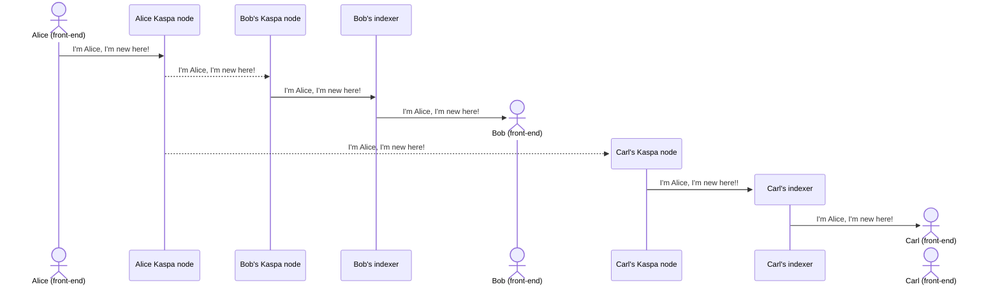
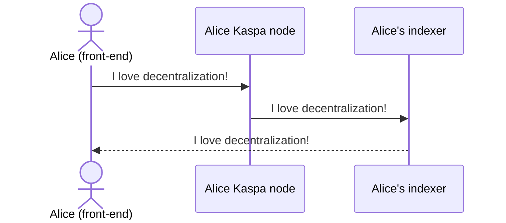
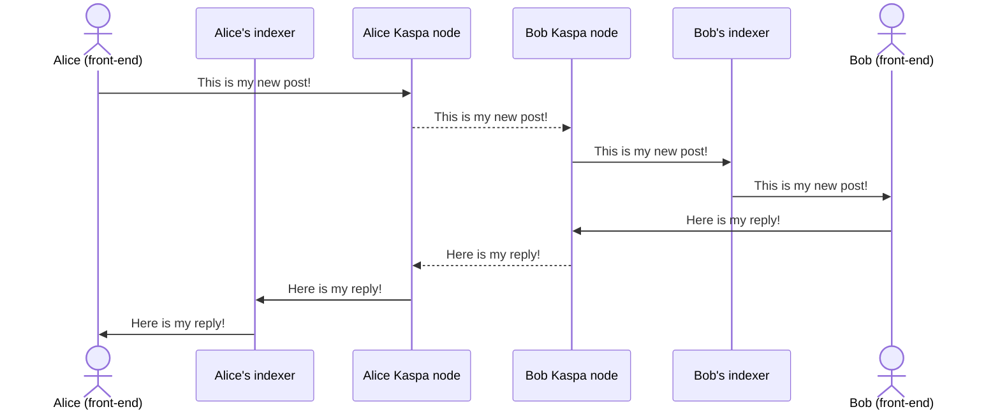
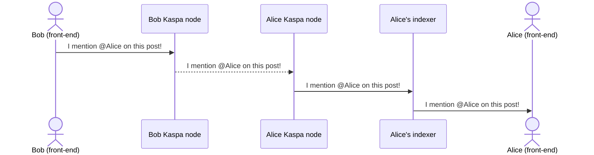
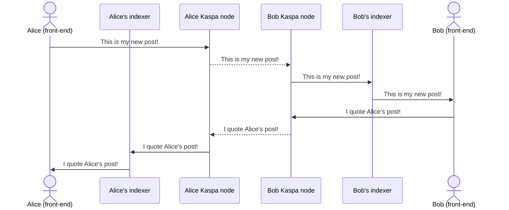
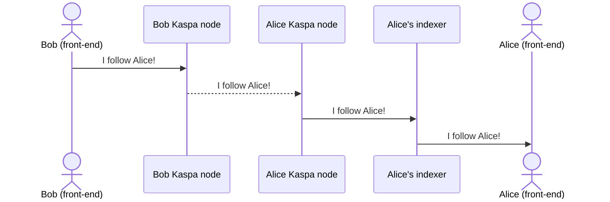
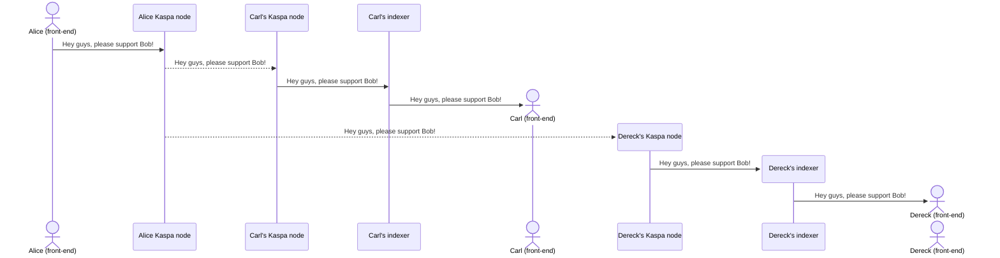

## User journey
Here i describe a high-level user journey of each use case, highlighting the K protocol specifications, which define how the information have to be exchnaged in Kaspa network, included in transaction payload, etc.

**Legend:**
  ✅ Features already implemented, with established K protocol definition.
  ❌ Features not yet implemented; K protocol definition could change.

### ✅  User presentation to the other network users
- User A activates the app for the first time and creates its own "K identity" (represented by a unique pair of private and public keys);
- This identity is unique in the whole network and represent only this specific user;
- User A locally backup the required data to restore its account, in case he needs to use it on another clinet;
- After creating its identity, User A fund its account by sending a small amount of KAS from his personal wallet, in order to pay for fees;
- User A broadcast the first message in K network, by informing everyone about his skills, interest, topics of choice, etc; in this way, he's promoting its new presence on the network;
- User A can repeat this broadcast overtime, to show his constant presence and desire to get connected to other users.



**Protocol Specifications**

Action: `broadcast`

**Payload Format:**
```
k:1:broadcast:sender_pubkey:sender_signature:base64_encoded_nickname:base64_encoded_profile_image:base64_encoded_message
```
### Field Descriptions
- `sender_pubkey`: The public key of the message sender
- `sender_signature`: Digital signature for consistency verification
- `base64_encoded_nickname`: The user name (nickname) to broadcast, encoded in Base64
- `base64_encoded_profile_image`: The profile image to broadcast, encoded in Base64
- `base64_encoded_message`: The message to broadcast, encoded in Base64

### Example Usage
```
k:1:broadcast:02218b3732df2353978154ec5323b745bce9520a5ed506a96de4f4e3dad20dc44f:fad0be9e2e4576708e15a4e06b7dd97badab1e585bbe15542a20fe4eba016c1a681f759c9f51e5801d5eeafc6cc62491b064661abba8b4b96e8118b74039f397:TXkgbmlja25hbWU=:UklGRjAPAABXRUJQVlA4WAoAAAAgAAAAMQAAMQAASUNDUMgBAAAAAAHIAAAAAAQwAABtbnRyUkdCIFhZWiAH4AABAAEAAAAAAABhY3NwAAAAAAAAAAAAAAAAAAAAAAAAAAAAAAAAAAAAAQAA9tYAAQAAAADTLQAAAAAAAAAAAAAAAAAAAAAAAAAAAAAAAAAAAAAAAAAAAAAAAAAAAAAAAAAAAAAAAAAAAAlkZXNjAAAA8AAAACRyWFlaAAABFAAAABRnWFlaAAABKAAAABRiWFlaAAABPAAAABR3dHB0AAABUAAAABRyVFJDAAABZAAAAChnVFJDAAABZAAAAChiVFJDAAABZAAAAChjcHJ0AAABjAAAADxtbHVjAAAAAAAAAAEAAAAMZW5VUwAAAAgAAAAcAHMAUgBHAEJYWVogAAAAAAAAb6IAADj1AAADkFhZWiAAAAAAAABimQAAt4UAABjaWFlaIAAAAAAAACSgAAAPhAAAts9YWVogAAAAAAAA9tYAAQAAAADTLXBhcmEAAAAAAAQAAAACZmYAAPKnAAANWQAAE9AAAApbAAAAAAAAAABtbHVjAAAAAAAAAAEAAAAMZW5VUwAAACAAAAAcAEcAbwBvAGcAbABlACAASQBuAGMALgAgADIAMAAxADZWUDhMQQ0AAC8xQAwADXUhov8Bz9q2HXL+/9953VV3dVU73bH5sm2bU7w90xK8p+/he/ReBRsj27aRvGM8eYJ2Vd26gkYWwZJtS4okSU9EVc3d3IKjmJl5ykuopfaQGUY8KmZGr0gHA1UR8S1Jkmrbtm2ZR2QppdbaoNOYzMz0xnP+/wszdmZs2FutJTM8HLhtG0mLHL3H3aqz+4ZPffB9AAAwoAYCAAoAAA3UIDEMAMYAAMAhiCBCFKKYAAAAAMDgrlZ/tXXxYWfFUI3Cspn+6VaxpksSZpckzAAAwCUBAAQAQgDGAIEBHAUEfJU+UACn/ufdz3548fGYKchUci/oXo7t3k++csNuAxDmSyXC7JIAAAABKEbACAAkwVEAEeMqxtTenc/+eL7Wo5VyL+Zea83NTfbrLx58ec8Px7f+cMv3BkBwaQCXBAoAghBTEDEASMRhoKt8mldv16/O/7tsZL+fOavxbj+eumi6pVy+78FnX711a26bd77/zYzP8AIAYAYAhBkCq5gCEBBiCogCEji4gnNaj67eK5YP3Pdy7vpyCkYW5ebm1ElZ06zHhsv/7vJ3Dz19/MOvMAAASCIzAwABKCIAAKaIYIoJAKQNdiJsf93q6uF0uEUr7PFL+JZBTU7lEUHN+yGjPhqu3vz/dwUBADBwEoBsMIDo+m4JSAAhYgx2QANKVkM+koKQyNSQrfktSRy2yUQNLZqjqOr8SC5XYeCU56IuBTABChjAoitUGi3RooPMfQe/KlzC92CgQNZQas8j01RaZhnhRAzdBQIAA7kRuCQQQIQYD84Ew225Vifrce2Yf705urutt5qNlhb9x1OmtTjGOhlPOwSEHeoezwAgYBWZCRgugLhCiHK1yLz5l2V7cNy1Unzo8ukL4/jikKvzrRfL2dIvsMdonaAQgghhgR3qaQRFZpd0Nc52H903htdipYXNNe12c/26cxau47akR3/O8RaV5On1uP3x8+zfvw4QUV19XY1ICbMwuyQAwWDSiBjf+jsvvRGpXlitr99zpsWbHbbL20cevz4Lonu5ZoZaHgEACF22CMyI4dIgIBBmlwTqCvwHP2/HvRJxkiLn8d91BU44NzACJE28jKVqd7PpEiOgVxVUMF+gOhhmIsQ0Vz+7t56S7r+e6Mef2/znw533d2dj0UttsK3FvVNr9S/vXaxwuX9CFGYRgKErnVcGBwYQy+988o8nHiSL15dUtT17flnFxeYjU1j2Dfr+v77NN8cUsNCth0SEGV1qRkqywUDmgfePKQIGhMV+d7rPR+4YSjY3bafhm00ysNOtc/v3NWtu3AIg9Coi1HW8FMWqC7oHmguYsomxH0/++dOd9zz44p70QZxt57euTqOwu1yjGnXymi4U9TGBAQ4BAAQwszCoxBiBo7RgZZC5avn1H++++57zkVs381tlzEcWa8u8QkCqrySCbsqQxDDQLT1VDGWSbYg6Vrd3P/nFvbfuOmubm8YvxpbnUC2dsrs09cBGQKjreWTu7wAOHJUKKtlEGQHiMPVY/cef73zsgy+MbA42uGt4+8rJlevtDz2+2V1geWG9zyEgYAAgqX9AmKXSJB1rCmkSoiRTFibvviqd35TOP955cvFAuZjB1WybFA0fpViHLkDru3/C5xP6Z2COMmAYaZLWcoLfkpednXLx5Myap9z35v1kEIZIy3k1p63sWm3GxwIDE1xsu2cAIcbne+1vLBjKRrc62Jd4nL2I+Ljt/PRJRJ/LXZlcopUIFY9xfZztYWsiuRCAcKwH2SA1cI++S1aB+vZTYAUvOyqT8Clt2Whzo8pWTX5/atWVWEMJpXZqlaxj1L+5xxqJGR6FGCdMbGGzrERoexAEfRoF1fcQSJCZksztugnKGmUFTjmPsLh0a3r0gy+N3/5c9mvcjRCgeNPGffN508Ka2wmVQrfwhZyqGRmUZJAxYgsbdD1sAJxB6TLJRkvmCR61cRrqh/OIsgqrSluVvj6957NbRd03+qEz2aW1x+2Pv/piUsNYel1XxsF+nju7dqjTmo7wpVAcSbU8zkcNNJd70qHGTZSkPZzk6fF49vxKabNLpHU6ufzw06DG4pGVcQJ2xD9+/uTjt1995KcTfz5ij7gtoQqR9drY6CxZ3OxjW4phIXS/7vqemG1zQ0vK8tftfNtAx5qvri3Lfh7V1dg8PfzCb+1fv/3s4ZOPDo+F4KDDtHM4nvj4q58Y/OQ83TQGH48LpQvUqlNAGVGrbnIgIBRiZyDI1rOuSo/HOvV2mdfGZbpfc3l0lkiP2/39bn72/jzZs/VwPeoe5VSO/M/haHu3fWSf7/3wXrDxSLff3m3rR8bWQ7eM8urMvkPqjjffq3vdfu8Xp2rum4vJlarI+p+Sz3XXDCZiZBeTVzcye6Y/HNRcmjmKttit2vSLz75cYW7OilbORAUCLxWsYnXaFGVAy8iSRpiKn8zIIyw1KHQcwxRHVDsfaZ+f1zVychfkeH2Pg0BHfj0idMvly5N5xx6b80nlZLV1bs0pGlCBQmQUPhxj+eygGyxTp075tIa5GAa+vDg4HpszNZ2Gt0JE01unpYomZQ3Xcb1JagW6euKjw62NwxGHGzbbGiQ9o+W8+drbLYtDxS3gweh4WkIorEfS0rQoqDOrm3NO+3OmIpByrXHboP+1aVZ6rRsiptTS69ZIupIi8NXhenjTXK87FnfaHEi1W0rKkwoSh4e5mtfmtEhTXPO6xcTGbchRha5HAixBgegfRHi7jZWBddeN2g+bEs+kDKa8qFiSQRtClVWj2FVxKGmYhCZsCj+tIKGVQLYvE3kIO+u8Ix0KVJArbpPEpe4axACUVTAS8cfMeEzrSdOR4sCuVu7sQnFott1Q7g3tGVu8MLRTYCVVC+1hHC+q4Yo2V9HmQkoGq/Pk7jfVZZnYRzTJqEgU5m5b0z4jX5/T388RbvqyPeedRjNStWhKz+l82jmRXt5c7m4/7bzpNp/M5DW1NSoHB4ZgEzl+sZVst2U9juZi39AWeTSmWYwpFV/kgUtUhn08A2/Q3vfOO5RUlSP/NOcdPdFUWrLCMF0dzdv1Xz4DnPrQTYk3Q2bERLlAkTKvhB0E4Vzuk3INOPj2s/+42I/8vGR0uNUIr8/0YeN7nJoLgrMSZpvUxxBoGbQapeIb59zdR/WkT1ikS3PTdDBu5rohGK42IrSWc1dOPgTdDTuM/XJwYtWCUllXwbJlUZwllk2nq9vf+vv0cw/zGf3DCX976/Djz0NKJpTv+2VLpeBhq2P09KC0tr3VSq9aZCJW+/Ec3XkgwmUnZqQ62p94ww0ngTo6ntiUSSjAibdTkgJVzNVLb//plf5lYXbYRHd/KG63QTekyS5iiT4XEoGRUkJhvS4/d7/w6Lkc59bnd//x1SciMelWK04hT1CSxArpKh0tS/fCRk0GGKnhRDoNMhujDZWHnt509WS3r/GI6tZyytXjXeHOSMlsUL3/IThsGUpxxVtv/q85HNJSd3T7BV2p7bb//5Wfv/cFm2q/841VgjX1sAlvXQ5ypfuKn0srUoslgBGVeHSaji8uH3v1r956zbg5UGUyu6POP786XIaW5ABEn1tjBC2l1r069we6jxWKV6Rrlee4/el/3fjyX7/43ncPVp1TyTLq49YigDGNdHsXDNGpDKfY1DVKiXrzYc7mC69yQ+Xm3vHM7h3Xtv/xF+znnxAAlDegnqWAHaUVpd6+9z3fe/5/cibvQ3FGCCdB89kHX33wtd///OMvLHz6KVGqXXFhpO6nqnY3Dud0JC0yaahQIJA67Ibq93P3PlZUAHWf177/wv/+/Z36p5/khcN5yenQbqDeZkfZKCVI006d/ls392yuMlqL7oZS3DnKPLg5bxSfHJbmd58cf7+L21wig1Hl00OhrfmyTg7nNTsZKz22gIuHPnP/y4X/fC/zq5/7TY221G/mMtSqqOSSHmJvoCOKhR74raDVWsv77jR95Xn5ch+ZqnkYbeXRahVBWwOJ3MxsPtx63yPVmX2wyGCy5qr0tNTGbbxs2KU3++j8Q+7kqlh9+Jvfhvswqqh5bFj/PS2TlJTesSApmHt/LliwKito4FvT3//8vdpadtgPP/zmtXufL+ceurVER6GUggrqKB5TyTAgwmlxVtfS2eXUXc+twtiohUAtoibv/ld471u6YVydOeMamqi1uaQ9VzoxesFElANDWbVJuvnbrbTIrjTyt+9+4+8/G37k/t3XF7fLjUu0inQuySh6RTEIMzaYrCR4AJAOYQo4cJC/+9n+H35HS8ZzusRwrdro/JqkSUfz6D0ZAoMLW5UBq92oZUYTU4uf//z49r//4N+nN1/814/zpdc3+4Ort3O3XYyt1opWGKtIXUBgQ4BzZCiHIoF1EGJszs/+d/V25evPkWYtnO8Px8sSWMkiQyEH457EElYwUUYx3Ti10jpB2/gSR+McMWZ+OJnY7Mu5v/bhZ/730JO/PHr/29/vxvI6f9KHy43UTlioLQRmJwqgqnAUC4DaM/fHfv2rIY1UxwEqpK4hQQTAXVcZAAA=:SSBsb3ZlIGRlY2VudHJhbGl6YXRpb24h
```

---


### ✅ Posting the first message
- User A posts his first message on K network, to let everyone know how exciting decentralization and Kaspa are.




**Protocol Specifications**

Action: `post`

**Payload Format:**
```
k:1:post:sender_pubkey:sender_signature:base64_encoded_message:mentioned_pubkeys
```
### Field Descriptions
- `sender_pubkey`: The public key of the message sender
- `sender_signature`: Digital signature for consistency verification
- `base64_encoded_message`: The message to post, encoded in Base64
- `mentioned_pubkeys`: Comma separated list of user pubkeys mentioned on the post

### Example Usage
```
k:1:post:02218b3732df2353978154ec5323b745bce9520a5ed506a96de4f4e3dad20dc44f:fad0be9e2e4576708e15a4e06b7dd97badab1e585bbe15542a20fe4eba016c1a681f759c9f51e5801d5eeafc6cc62491b064661abba8b4b96e8118b74039f397:SSBsb3ZlIGRlY2VudHJhbGl6YXRpb24h:[0279be667ef9dcbbac55a06295ce870b07029bfcdb2dce28d959f2815b16f81798,03f028892cf44c055f49c2c8b6fbdd4c56c54eae8dfaf4babe8a411d563bb0df3e]
```
---


### ✅ Replying user contents
- User A can setup his own account to:
  - Allow all users to reply to his posts;
  - Allow only user who support him to reply to his posts;
- User B can freely reply to User A posts (whether he support User A or not);
- Depending on User A settings (above), User A receive the reply, gets notified about the reply, read the reply or ignore it (not visualizing it).




**Protocol Specifications**

Action: `reply`

**Payload Format:**
```
k:1:reply:sender_pubkey:sender_signature:post_id:base64_encoded_message:mentioned_pubkeys
```

### Field Descriptions
- `sender_pubkey`: The public key of the message sender
- `sender_signature`: Digital signature for consistency verification
- `post_id`: The reference to the post being replied to
- `base64_encoded_message`: The message to post, encoded in Base64
- `mentioned_pubkeys`: Comma separated list of user pubkeys mentioned on the reply (aythors of the previous posts or replies this specific reply refers to)

### Example Usage
```
k:1:post:02218b3732df2353978154ec5323b745bce9520a5ed506a96de4f4e3dad20dc44f:fad0be9e2e4576708e15a4e06b7dd97badab1e585bbe15542a20fe4eba016c1a681f759c9f51e5801d5eeafc6cc62491b064661abba8b4b96e8118b74039f397:1e321a6fad0a3c6f3cbbb61f54fcc047ec364e497b2d74a93f04963461a4e942:SSBsb3ZlIGRlY2VudHJhbGl6YXRpb24h:[0279be667ef9dcbbac55a06295ce870b07029bfcdb2dce28d959f2815b16f81798,03f028892cf44c055f49c2c8b6fbdd4c56c54eae8dfaf4babe8a411d563bb0df3e]
```

---

### ✅ Mentioning other users in posts or replies
- User A can setup his own account to:
  - Allow all users to mention him;
  - Allow only user who support him to to mention him;
- User B can freely mention User A on its posts or replies (whether he support User A or not);
- Depending on User A settings (above), User A receive the mention, gets notified about the mention, read the post/replies including the mention or ignore it (not visualizing it).




**Protocol specifications**
See previous paragraphs ("Posting a message" and "Replying to user contents")

---

### ✅ Upvoting/downvoting user contents
- User A can setup his own account to:
  - Gets notified if someone upvote/downvote its content;
  - Gets notified if someone quotes upvote/downvote its content;
- User B can freely upvote/downvote a User A content (whether he support User A or not);
- Depending on User A settings (above), User A receive the upvote/downvote, gets notified about the upvote/downvote, see the upvote/downvote or ignore it (not visualizing it).


**Protocol Specifications**
  Action: `vote`
  **Payload Format:**
  ```
  k:1:vote:sender_pubkey:sender_signature:post_id:vote:mentioned_pubkey
  ```

### Field Descriptions- 
  - `sender_pubkey`: The public key of the message sender
  - `sender_signature`: Digital signature for consistency verification
  - `post_id`: The reference to the post being voted
  - `vote`: The value defining the user vote the content (upvote/downvote)
  - `mentioned_pubkey`: The pubkey of the author of the post/reply being voted
 
### Example Usage
  ```
  k:1:vote:02218b3732df2353978154ec5323b745bce9520a5ed506a96de4f4e3dad20dc44f:fad0be9e2e4576708e15a4e06b7dd97badab1e585bbe15542a20fe4eba016c1a681f759c9f51e5801d5eeafc6cc62491b064661abba8b4b96e8118b74039f397:1e321a6fad0a3c6f3cbbb61f54fcc047ec364e497b2d74a93f04963461a4e942:upvote:030f657a3c77eab35c8f3d8d7bcf4ee1ca3aac7f991d0e3abacdb17e3c5de3b2f7
  ```

---

### ✅ Quoting user contents
- User A can setup his own account to:
  - Gets notified if someone quote its content (forwarding a post/reply);
- User B can freely quote a User A content in it's own profile (whether he support User A or not);
- Depending on User A settings (above), User A receive the quote, gets notified about the quote, read the quote or ignore it (not visualizing it).




**Protocol Specifications**

Action: `quote`

**Payload Format:**
```
k:1:quote:sender_pubkey:sender_signature:content_id:base64_encoded_message:mentioned_pubkey
```

### Field Descriptions
- `sender_pubkey`: The public key of the message sender
- `sender_signature`: Digital signature for consistency verification
- `content_id`: The reference to the post/reply being quoted
- `base64_encoded_message`: The message to post, encoded in Base64
- `mentioned_pubkey`: The pubkey of the author of the post/reply being quoted

### Example Usage
```
k:1:quote:02218b3732df2353978154ec5323b745bce9520a5ed506a96de4f4e3dad20dc44f:fad0be9e2e4576708e15a4e06b7dd97badab1e585bbe15542a20fe4eba016c1a681f759c9f51e5801d5eeafc6cc62491b064661abba8b4b96e8118b74039f397:1e321a6fad0a3c6f3cbbb61f54fcc047ec364e497b2d74a93f04963461a4e942:SSBsb3ZlIGRlY2VudHJhbGl6YXRpb24h:0279be667ef9dcbbac55a06295ce870b07029bfcdb2dce28d959f2815b16f81798
```
---

### ✅ Blocking users
- Even if User B follow or support User A, User A can freely decide to block User B, blocking notifications related to all main actions (replies, mentions, reposts, quotes);
- User B can freely mention User A and reply, reposts and quote User A contents but User A will never be notified about these actions.


 ```mermaid
  sequenceDiagram
    actor A as Alice (front-end)
    A->>Alice Kaspa node: I want to block Bob!
    Alice Kaspa node->>Alice's indexer: I want to block Bob!
    Alice's indexer->>A: Bob is blocked!
```

**Protocol Specifications**
  Action: `block`

**Payload Format:**
  ```
  k:1:block:sender_pubkey:sender_signature:blocking_action:blocked_user_pubkey
  ```

### Field Descriptions- 
  - `sender_pubkey`: The public key of the message sender
  - `sender_signature`: Digital signature for consistency verification
  - `blocking_action`: The value defining the blocking action (block/unblock)
  - `blocked_user_pubkey`: The pubkey of the user being blocked/unblocked
 
### Example Usage
  ```
  k:1:block:02218b3732df2353978154ec5323b745bce9520a5ed506a96de4f4e3dad20dc44f:fad0be9e2e4576708e15a4e06b7dd97badab1e585bbe15542a20fe4eba016c1a681f759c9f51e5801d5eeafc6cc62491b064661abba8b4b96e8118b74039f397:block:030f657a3c77eab35c8f3d8d7bcf4ee1ca3aac7f991d0e3abacdb17e3c5de3b2f7
  ```
---

### ✅ Following/unfollowing users
- User B, who already activated a K account last month, receive the broadcast message from User A and decides to follow him;
- User B activates the "following" process: everytime User A posts something new, User B is alerted and visualize this new content ona dedicated sesction of K;
- When User B activate the following process, User A is notified: now he knows User B is following him; in addition, everyone else in the network knows User A is supported by User B; 
- In the meantime, User C, another long time K user, received User A broadcast and start following and receiving contents when User A posts something.




**Protocol Specifications**

Action: `follow`

**Payload Format:**
```
k:1:follow:sender_pubkey:sender_signature:following_action:followed_user_pubkey
```

### Field Descriptions- 
  - `sender_pubkey`: The public key of the message sender
  - `sender_signature`: Digital signature for consistency verification
  - `following_action`: The value defining the following action (follow/unfollow)
  - `followed_user_pubkey`: The pubkey of the user being followed/unfollowed

### Example Usage
```
k:1:follow:02218b3732df2353978154ec5323b745bce9520a5ed506a96de4f4e3dad20dc44f:fad0be9e2e4576708e15a4e06b7dd97badab1e585bbe15542a20fe4eba016c1a681f759c9f51e5801d5eeafc6cc62491b064661abba8b4b96e8118b74039f397:follow:030f657a3c77eab35c8f3d8d7bcf4ee1ca3aac7f991d0e3abacdb17e3c5de3b2f7
```
---

### ❌ Endorsing (suggesting) users (not yet confirmed)
- User A like User B so much that he feels like User B deserve an endorsement, due to the value of his contents;
- User A broadcast an "endorsement" message to all his supporting users, suggesting to follow and support User B;
- All users supporting User A receive a notification which invites them to support User B.




**Protocol Specifications**

Action: `suggest`

**Payload Format:**
```
k:1:suggest:sender_pubkey:sender_signature:suggested_pubkey:base64_encoded_message
```

### Field Descriptions
- `sender_pubkey`: The public key of the message sender
- `sender_signature`: Digital signature for consistency verification
- `suggested_pubkey`: The public key of the user to suggest
- `base64_encoded_message`: The message to attach to user suggestion, encoded in Base64

### Example Usage
```
k:1:suggest:02218b3732df2353978154ec5323b745bce9520a5ed506a96de4f4e3dad20dc44f:fad0be9e2e4576708e15a4e06b7dd97badab1e585bbe15542a20fe4eba016c1a681f759c9f51e5801d5eeafc6cc62491b064661abba8b4b96e8118b74039f397:0279be667ef9dcbbac55a06295ce870b07029bfcdb2dce28d959f2815b16f81798:SSBsb3ZlIGRlY2VudHJhbGl6YXRpb24h

```

---