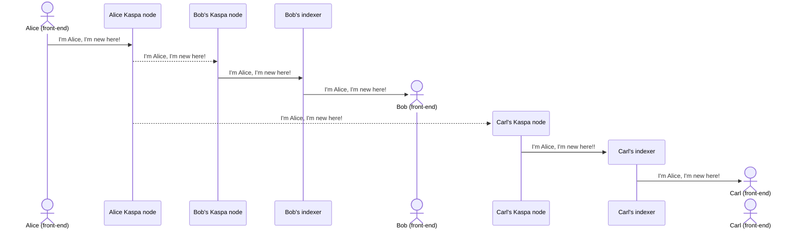
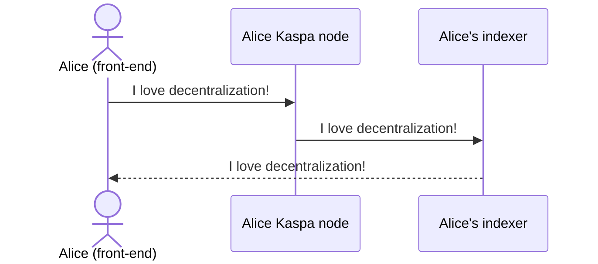
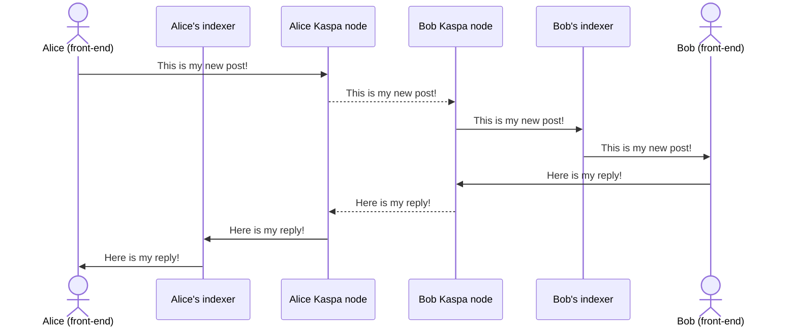
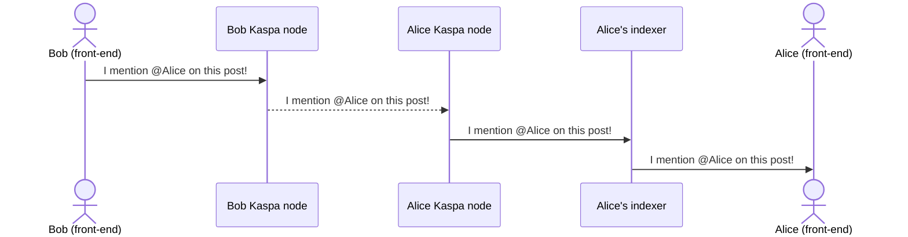
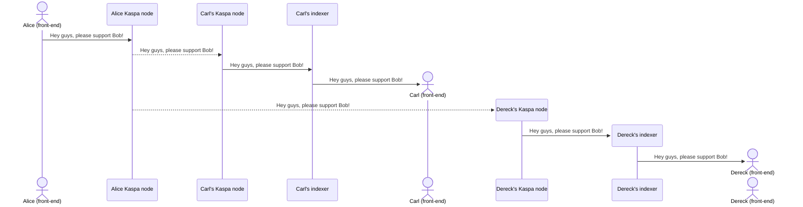
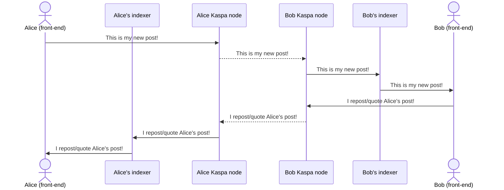

## User journey
Here i describe a high-level user journey of each use case, highlighting the K protocol specifications, which define how the information have to be exchnaged in Kaspa network, included in transaction payload, etc.

**Legend:**
  ✅ Features already implemented, with established K protocol definition.
  ❌ Features not yet implemented; K protocol definition could change.

### ✅  User presentation to the other network users
- User A activates the app for the first time and creates its own "K identity" (represented by a unique pair of private and public keys);
- This identity is unique in the whole network and represent only this specific user;
- User A locally backup the required data to restore its account, in case he needs to use it on another clinet;
- After creating its identity, User A fund its account by sending a small amount of KAS from his personal wallet, in order to pay for fees;
- User A broadcast the first message in K network, by informing everyone about his skills, interest, topics of choice, etc; in this way, he's promoting its new presence on the network;
- User A can repeat this broadcast overtime, to show his constant presence and desire to get connected to other users.



**Protocol Specifications**

Action: `broadcast`

**Payload Format:**
```
k:1:broadcast:sender_pubkey:sender_signature:base64_encoded_message
```
### Field Descriptions
- `sender_pubkey`: The public key of the message sender
- `sender_signature`: Digital signature for consistency verification
- `base64_encoded_message`: The message to broadcast, encoded in Base64

### Example Usage
```
k:1:post:02218b3732df2353978154ec5323b745bce9520a5ed506a96de4f4e3dad20dc44f:fad0be9e2e4576708e15a4e06b7dd97badab1e585bbe15542a20fe4eba016c1a681f759c9f51e5801d5eeafc6cc62491b064661abba8b4b96e8118b74039f397:SSBsb3ZlIGRlY2VudHJhbGl6YXRpb24h
```

---


### ✅ Posting the first message
- User A posts his first message on K network, to let everyone know how exciting decentralization and Kaspa are.




**Protocol Specifications**

Action: `post`

**Payload Format:**
```
k:1:post:sender_pubkey:sender_signature:base64_encoded_message:mentioned_pubkeys
```
### Field Descriptions
- `sender_pubkey`: The public key of the message sender
- `sender_signature`: Digital signature for consistency verification
- `base64_encoded_message`: The message to post, encoded in Base64
- `mentioned_pubkeys`: Comma separated list of user pubkeys mentioned on the post

### Example Usage
```
k:1:post:02218b3732df2353978154ec5323b745bce9520a5ed506a96de4f4e3dad20dc44f:fad0be9e2e4576708e15a4e06b7dd97badab1e585bbe15542a20fe4eba016c1a681f759c9f51e5801d5eeafc6cc62491b064661abba8b4b96e8118b74039f397:SSBsb3ZlIGRlY2VudHJhbGl6YXRpb24h:[0279be667ef9dcbbac55a06295ce870b07029bfcdb2dce28d959f2815b16f81798,03f028892cf44c055f49c2c8b6fbdd4c56c54eae8dfaf4babe8a411d563bb0df3e]
```
---


### ✅ Replying user contents
- User A can setup his own account to:
  - Allow all users to reply to his posts;
  - Allow only user who support him to reply to his posts;
- User B can freely reply to User A posts (whether he support User A or not);
- Depending on User A settings (above), User A receive the reply, gets notified about the reply, read the reply or ignore it (not visualizing it).




**Protocol Specifications**

Action: `reply`

**Payload Format:**
```
k:1:reply:sender_pubkey:sender_signature:post_id:base64_encoded_message:mentioned_pubkeys
```

### Field Descriptions
- `sender_pubkey`: The public key of the message sender
- `sender_signature`: Digital signature for consistency verification
- `post_id`: The reference to the post being replied to
- `base64_encoded_message`: The message to post, encoded in Base64
- `mentioned_pubkeys`: Comma separated list of user pubkeys mentioned on the reply (aythors of the previous posts or replies this specific reply refers to)

### Example Usage
```
k:1:post:02218b3732df2353978154ec5323b745bce9520a5ed506a96de4f4e3dad20dc44f:fad0be9e2e4576708e15a4e06b7dd97badab1e585bbe15542a20fe4eba016c1a681f759c9f51e5801d5eeafc6cc62491b064661abba8b4b96e8118b74039f397:1e321a6fad0a3c6f3cbbb61f54fcc047ec364e497b2d74a93f04963461a4e942:SSBsb3ZlIGRlY2VudHJhbGl6YXRpb24h:[0279be667ef9dcbbac55a06295ce870b07029bfcdb2dce28d959f2815b16f81798,03f028892cf44c055f49c2c8b6fbdd4c56c54eae8dfaf4babe8a411d563bb0df3e]
```

---

### ❌ Mentioning other users in posts or replies (not yet completed)
- User A can setup his own account to:
  - Allow all users to mention him;
  - Allow only user who support him to to mention him;
- User B can freely mention User A on its posts or replies (whether he support User A or not);
- Depending on User A settings (above), User A receive the mention, gets notified about the mention, read the post/replies including the mention or ignore it (not visualizing it).




**Protocol specifications**
See previous paragraphs ("Posting a message" and "Replying to user contents")

---

### ✅ Upvoting/downvoting user contents
- User A can setup his own account to:
  - Gets notified if someone upvote/downvote its content;
  - Gets notified if someone quotes upvote/downvote its content;
- User B can freely upvote/downvote a User A content (whether he support User A or not);
- Depending on User A settings (above), User A receive the upvote/downvote, gets notified about the upvote/downvote, see the upvote/downvote or ignore it (not visualizing it).


**Protocol Specifications**
  Action: `vote`
  **Payload Format:**
  ```
  k:1:vote:sender_pubkey:sender_signature:post_id:vote
  ```

### Field Descriptions- 
  - `sender_pubkey`: The public key of the message sender
  - `sender_signature`: Digital signature for consistency verification
  - `post_id`: The reference to the post being voted
  - `vote`: The value defining the user vote the content (upvote/downvote)
 
### Example Usage
  ```
  k:1:vote:02218b3732df2353978154ec5323b745bce9520a5ed506a96de4f4e3dad20dc44f:fad0be9e2e4576708e15a4e06b7dd97badab1e585bbe15542a20fe4eba016c1a681f759c9f51e5801d5eeafc6cc62491b064661abba8b4b96e8118b74039f397:1e321a6fad0a3c6f3cbbb61f54fcc047ec364e497b2d74a93f04963461a4e942:upvote
  ```

---


### ❌ Watching a user (not yet confirmed)
- User B activates the "watching" process: everytime User A posts something new, User B is alerted and visualize this new content on his K home page.

 ```mermaid
sequenceDiagram
    actor B as Bob (front-end)
    B->>Bob's indexer: I want to watch Alice!
    actor A as Alice (front-end)
    A->>Alice Kaspa node: I love Kaspa!
    Alice Kaspa node-->>Bob Kaspa node: I love Kaspa!
    Bob Kaspa node->>Bob's indexer: I love Kaspa!
    Bob's indexer->>B: I love Kaspa!
```
**Protocol specifications**
No protocol definition is required.

---


### ❌ Endorsing (suggesting) users (not yet confirmed)
- User A like User B so much that he feels like User B deserve an endorsement, due to the value of his contents;
- User A broadcast an "endorsement" message to all his supporting users, suggesting to follow and support User B;
- All users supporting User A receive a notification which invites them to support User B.




**Protocol Specifications**

Action: `suggest`

**Payload Format:**
```
k:1:suggest:sender_pubkey:sender_signature:suggested_pubkey:base64_encoded_message
```

### Field Descriptions
- `sender_pubkey`: The public key of the message sender
- `sender_signature`: Digital signature for consistency verification
- `suggested_pubkey`: The public key of the user to suggest
- `base64_encoded_message`: The message to attach to user suggestion, encoded in Base64

### Example Usage
```
k:1:suggest:02218b3732df2353978154ec5323b745bce9520a5ed506a96de4f4e3dad20dc44f:fad0be9e2e4576708e15a4e06b7dd97badab1e585bbe15542a20fe4eba016c1a681f759c9f51e5801d5eeafc6cc62491b064661abba8b4b96e8118b74039f397:0279be667ef9dcbbac55a06295ce870b07029bfcdb2dce28d959f2815b16f81798:SSBsb3ZlIGRlY2VudHJhbGl6YXRpb24h

```

---


### ❌ Following/unfollowing and supporting/unsupporting a user (not yet confirmed)
- User B, who already activated a K account last month, receive the broadcast message from User A and decides to follow him;
- User B activates the "following" process: everytime User A posts something new, User B is alerted and visualize this new content on his K home page;
- User B decides that User A contents are interesting, therefore he chooses to support him;
- When activating the supporting process, User B is sending a certain amount of KAS to User A;
- User A is notified: now he knows User B is supporting him; in addition, everyone else in the network knows User A is supported by User B; 
- In the meantime, User C, another long time K user, received User A broadcast and start following and receiving notifications when User A posts something;
- But User C doesn't like User A contents, therefore he doesn't activate the supporting process and, after few days, he also unfollow User A.


**Protocol Specifications**

Action: `support`

**Payload Format:**
```
k:1:support:message_body
```

**Message Body Structure:**
```json
{
  "sender_pubkey": "",
  "sender_signature": "",
  "message": "",
  "recipient_pubkey": ""
}
```

### Example Usage
```
k:1:support:{"sender_pubkey":"abc123","sender_signature":"def456","message":"I support Alice!","recipient_pubkey":"xyz987"}
```

### Field Descriptions
- `sender_pubkey`: The public key of the message sender
- `sender_signature`: Digital signature for message verification
- `message`: The message to post when supporting someone
- `recipient_pubkey`: The pubkey of the user being supported

---


### ❌ Reposting/quoting user contents (not yet confirmed)
- User A can setup his own account to:
  - Gets notified if someone repost (forwarding a message, adding considerations) its content;
  - Gets notified if someone quotes (forwarding a message) its content;
- User B can freely repost and quote a User A content in it's own profile (whether he support User A or not);
- Depending on User A settings (above), User A receive the repost/quote, gets notified about the repost/quote, read the repost/quote or ignore it (not visualizing it).




**Protocol Specifications**

Action: `repost`

**Payload Format:**
```
k:1:repost:message_body
```

**Message Body Structure:**
```json
{
  "sender_pubkey": "",
  "sender_signature": "",
  "tx_id": ""
}
```

### Example Usage
```
k:1:repost:{"sender_pubkey":"abc123","sender_signature":"def456","tx_id": "123456789"}
```

### Field Descriptions
- `sender_pubkey`: The public key of the message sender
- `sender_signature`: Digital signature for message verification
- `message`: empty
- `tx_id`: The reference to the user's post being reposted

-----------------------------

Action: `quote`

**Payload Format:**
```
k:1:quote:message_body
```

**Message Body Structure:**
```json
{
  "sender_pubkey": "",
  "sender_signature": "",
  "message": "",
  "tx_id": ""
}
```

### Example Usage
```
k:1:quote:{"sender_pubkey":"abc123","sender_signature":"def456","message":"This is my comment!","tx_id": "123456789"}
```

### Field Descriptions
- `sender_pubkey`: The public key of the message sender
- `sender_signature`: Digital signature for message verification
- `message`: The comment on the post being quoted
- `tx_id`: The reference to the user's post being quoted

---


---


### ❌ Blocking users (not yet confirmed)
- Even if User B follow or support User A, User A can freely decide to block User B, blocking notifications related to all main actions (replies, mentions, reposts, quotes);
- User B can freely mention User A and reply, reposts and quote User A contents but User A will never be notified about these actions.


 ```mermaid
sequenceDiagram
    actor A as Alice (front-end)
    A->>Alice's indexer: I want to block Bob!
    participant Alice Kaspa node
    participant Bob Kaspa node
    actor B as Bob (front-end)
    B->>Bob Kaspa node: I'm trying to reply to Alice's post!
    Bob Kaspa node-->>Alice Kaspa node: I'm trying to reply to Alice's post!
    Alice Kaspa node->>Alice's indexer: I'm trying to reply Alice's post!
```

---
