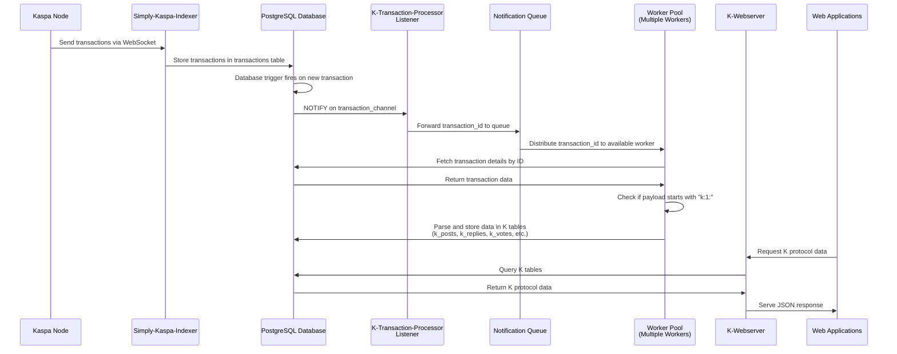

# K-indexer

> **⚠️ Proof of Concept - Testnet Only**  
> This is experimental software. Use only on testnet environments.

K-indexer is a simplified Kaspa transaction indexer designed specifically for indexing and serving K protocol transactions.

## 🚀 New Architecture

The new indexer architecture is composed of the following components:

- **🔗 Rusty-Kaspa Node**: A running rusty-kaspa node
- **💾 PostgreSQL Database**: Database for storing indexed data
- **📡 Simply-kaspa-indexer**: By supertypo (https://github.com/supertypo/simply-kaspa-indexer) to receive all transactions from Kaspa network and temporarily store them
- **🔍 K-transaction-processor**: Filters incoming transactions and indexes all K-related data in proper database tables
- **🌐 K-webserver**: Serves all K-related data to web applications via API calls
- **🧹 K-database-cleaner** *(Optional)*: Maintains a lighter, cleaner database for personal indexers by automatically purging unwanted content

### Process Flow



## 📚 Protocol Documentation

Technical specifications for the K protocol are available in the [official K repository](https://github.com/thesheepcat/K).

---

## 🛠️ Installation & Setup

### Prerequisites

- Linux Ubuntu server (recommended)
- Rust toolchain
- Docker
- Running rusty-kaspa node

### 📋 Step-by-Step Instructions

To run the indexer, proceed in the following way:

#### 1. **Activate Rusty-Kaspa Node**
Follow the [documentation here on how to run rusty-kaspa](https://kaspa.aspectron.org/running-rusty-kaspa.html)

**Required Node Parameters:**
- `--testnet`: Run on testnet (required for safety)
- `--utxoindex`: Enable UTXO indexing
- `--rpclisten-borsh=0.0.0.0:17120`: Enable BORSH RPC on all interfaces

#### 2. **Setup enviroment variables**
Navigate to docker/PROD folder, open .env file and set the variables depending on your preferences:

```bash
cd K-indexer/docker/PROD
nano .env
```
##### Variables description
| Variable | Default | Description |
|-----------|---------|-------------|
| `COMPOSE_PROFILES` | `public-indexer` | Indexer type: `public-indexer` or `personal-indexer` |
| `DB_USER` | `username` | PostgreSQL database username |
| `DB_PASSWORD` | `password` | PostgreSQL database password |
| `DB_NAME` | `k-db` | PostgreSQL database name |
| `DB_PORT` | `5432` | PostgreSQL database access port |
| `WEBSERVER_PORT` | `3000` | K-webserver access port (used by K-webapp, to connect to K-indexer) |
| `USER_PUBKEY` | - | Your Kaspa public key (required only for `personal-indexer`) |
| `DATA_RETENTION` | `72h` | How long to keep content from non-followed users (required only for `personal-indexer`) |
| `PURGE_INTERVAL` | `10m` | How often to run cleanup operations (required only for `personal-indexer`) |

**IMPORTANT**:
- Change `DB_USER` and `DB_PASSWORD` to secure values
- Set `COMPOSE_PROFILES` to `personal-indexer` and configure `USER_PUBKEY`, `DATA_RETENTION`, and `PURGE_INTERVAL` if running a personal indexer with k-database-cleaner

#### 3. **Activate all Services**
Navigate to docker/PROD folder and use docker compose to activate all services:

```bash
cd K-indexer/docker/PROD
docker compose up -d
```
The following services will be activated:
- k-indexer-db (PostgreSQL database)
- simply-kaspa-indexer
- k-transaction-processor
- k-webserver
- k-database-cleaner (only if set as "personal indexer")


---

## 📖 API Endpoints

Once running, K-indexer provides REST endpoints the K webapp.

You can find all details of the API techical specification in the [API_TECHNICAL_SPECIFICATIONS.md](API_TECHNICAL_SPECIFICATIONS.md) document.

---

## 🧹 Personal Indexer with K-database-cleaner

For users running a **personal indexer**, K-database-cleaner helps maintain a lightweight, efficient database by automatically removing unwanted data based on your preferences.

### Why Use K-database-cleaner?

When running a personal indexer, you may not want to store:
- Content from users you've blocked
- Old posts from users you don't follow
- Orphaned replies and votes that reference deleted content
- Follow/block records from other users

K-database-cleaner runs periodic purge operations to keep your database clean and storage-efficient, retaining only the content that matters to you.

### Key Features

- **Automated Cleanup**: Runs at configurable intervals (default: every 10 minutes)
- **Configurable Retention**: Set how long to keep content from non-followed users (default: 72 hours)
- **Single Query per Operation**: Optimized CTEs for efficient purging
- **Detailed Logging**: Reports exactly what was deleted in each cycle

### Getting Started

For full documentation on installation, configuration, and usage, see the [K-database-cleaner README](K-database-cleaner/README.md).

---

In case you need any support, please join us at the Kluster Discord server: https://discord.gg/vuKyjtRGKB
