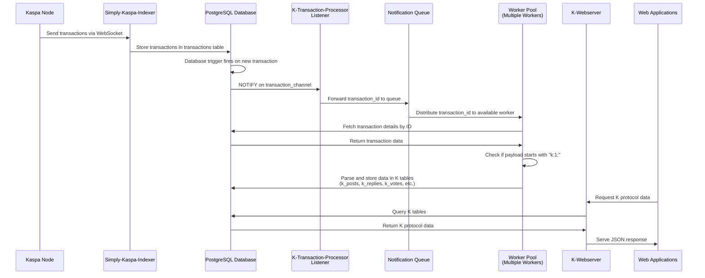

# K-indexer

> **⚠️ Proof of Concept - Testnet Only**  
> This is experimental software. Use only on testnet environments.

K-indexer is a simplified Kaspa transaction indexer designed specifically for indexing and serving K protocol transactions.

**Note:** All legacy K-indexer code has been moved into the `K-indexer-legacy` folder.

## 🚀 New Architecture

The new indexer architecture is composed of the following components:

- **🔗 Rusty-Kaspa Node**: A running rusty-kaspa node
- **💾 PostgreSQL Database**: Database for storing indexed data
- **📡 Simply-kaspa-indexer**: By supertypo (https://github.com/supertypo/simply-kaspa-indexer) to receive all transactions from Kaspa network and temporarily store them
- **🔍 K-transaction-processor**: Filters incoming transactions and indexes all K-related data in proper database tables
- **🌐 K-webserver**: Serves all K-related data to web applications via API calls

### Process Flow



## 📚 Protocol Documentation

Technical specifications for the K protocol are available in the [official K repository](https://github.com/thesheepcat/K).

---

## 🛠️ Installation & Setup

### Prerequisites

- Linux Ubuntu server (recommended)
- Rust toolchain
- Docker
- Running rusty-kaspa node

### 📋 Step-by-Step Instructions

To run the indexer, proceed in the following way:

#### 1. **Activate Rusty-Kaspa Node**
Follow the [documentation here on how to run rusty-kaspa](https://kaspa.aspectron.org/running-rusty-kaspa.html)

**Required Node Parameters:**
- `--testnet`: Run on testnet (required for safety)
- `--utxoindex`: Enable UTXO indexing
- `--rpclisten-borsh=0.0.0.0:17120`: Enable BORSH RPC on all interfaces

#### 2. **Setup Database and Services**
Navigate to docker/ folder and use docker compose to activate Postgres database and simply-kaspa-indexer by SuperTypo:

```bash
cd K-indexer/docker/
docker compose up -d
```

#### 3. **Compile and Run K-transaction-processor**
On the main folder compile K-transaction-processor:
```bash
cargo build --release -p K-transaction-processor
```

Run the compiled binary:
```bash
./target/release/K-transaction-processor --db-host localhost --db-port 5432 --db-name k-db --db-user username --db-password password --db-max-connections 10 --workers 4 --channel transaction_channel --retry-attempts 10 --retry-delay 1000
```

#### 4. **Compile and Run K-webserver**
On the main folder compile K-webserver:
```bash
cargo build --release -p K-webserver
```

Run the compiled binary:
```bash
# Basic usage (uses auto-detected CPU cores and intelligent defaults)
./target/release/K-webserver --db-host localhost --db-name k-db --db-user username --db-password password --bind-address 0.0.0.0:3000

# High-performance configuration
./target/release/K-webserver --db-host localhost --db-name k-db --db-user username --db-password password --bind-address 0.0.0.0:3000 --worker-threads 16 --db-max-connections 50 --request-timeout 45 --rate-limit 500
```

---

## 🔧 Configuration Options

### K-transaction-processor Options
| Parameter | Default | Description |
|-----------|---------|-------------|
| `--db-host` | `localhost` | PostgreSQL database host |
| `--db-port` | `5432` | PostgreSQL database port |
| `--db-name` | `k-db` | PostgreSQL database name |
| `--db-user` | `username` | PostgreSQL database username |
| `--db-password` | `password` | PostgreSQL database password |
| `--db-max-connections` | `10` | Maximum database connections |
| `--workers` | `4` | Number of worker threads |
| `--channel` | `transaction_channel` | Transaction channel name |
| `--retry-attempts` | `10` | Number of retry attempts |
| `--retry-delay` | `1000` | Retry delay in milliseconds |

### K-webserver Options
| Parameter | Default | Description |
|-----------|---------|-------------|
| `--db-host` | `localhost` | PostgreSQL database host |
| `--db-port` | `5432` | PostgreSQL database port |
| `--db-name` | `k-db` | PostgreSQL database name |
| `--db-user` | `username` | PostgreSQL database username |
| `--db-password` | `password` | PostgreSQL database password |
| `--bind-address` | `127.0.0.1:8080` | REST API listening address and port |
| `--worker-threads` | auto-detect CPU cores | Number of Tokio worker threads for request processing |
| `--db-max-connections` | `worker_threads * 3` (min 10) | Maximum database connection pool size |
| `--request-timeout` | `30` | Request timeout in seconds |
| `--rate-limit` | `100` | Rate limit: requests per minute per IP address |

---

## 📖 API Endpoints

Once running, K-indexer provides REST endpoints for:
- **Posts**: Retrieve user posts
- **Replies**: Access post replies  
- **Users**: Get user profiles and introductions
- **Mentions**: Find posts where users are mentioned

You can find all details of the API techical specification in the API_TECHNICAL_SPECIFICATIONS.md document.

In case you need any support, please join us at the Kluster Discord server: https://discord.gg/vuKyjtRGKB
