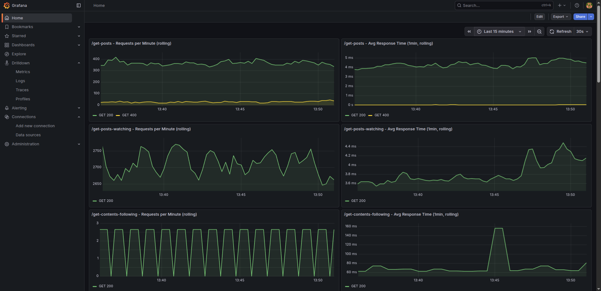

# K-Webserver Monitoring with Grafana & Prometheus

Monitor K-webserver API endpoints performance with Prometheus metrics and Grafana dashboards (highly suggested for public indexers).

## 🎯 Overview

The K-webserver monitoring stack provides real-time visibility into API endpoint performance through:

- **📈 Prometheus**: Scrapes metrics from K-webserver every 15 seconds
- **📊 Grafana**: Visualizes metrics with pre-configured dashboards
- **🔍 Automatic Provisioning**: Dashboards and data sources configured automatically

### What You Can Monitor

- **Request Rate**: Number of requests per endpoint (1-minute rolling window)
- **Response Time**: Average response time per endpoint (1-minute rolling window)
- **HTTP Status Codes**: Success/error rates by endpoint
- **Real-time Updates**: Dashboard refreshes every 1 minute

---

## 🛠️ Installation & Setup

### Prerequisites

- K-webserver running and accessible
- Docker and Docker Compose installed

### 📋 Step-by-Step Instructions

#### 1. **Configure Prometheus Target**

Navigate to the monitoring configuration folder:

```bash
cd K-indexer/docker/MONITORING
```

Open `prometheus.yml` and update the K-webserver endpoint:

```yaml
scrape_configs:
  - job_name: 'k-webserver'
    static_configs:
      - targets: ['localhost:3000']  # Change to your K-webserver address
    metrics_path: '/metrics'
    scrape_interval: 15s
```

**Configuration Notes:**
- Replace `localhost:3000` with your K-webserver address (host:port)
- If K-webserver is on a remote server, use the server's IP address or hostname

#### 2. **Start Monitoring Services**

From the `docker/MONITORING` folder, start Prometheus and Grafana:

```bash
cd K-indexer/docker/MONITORING
docker compose up -d
```

This will start:
- **Prometheus** on port `9090`
- **Grafana** on port `3011`

#### 3. **Access Grafana Dashboard**

Open your browser and navigate to:

```
http://localhost:3011
```

**Default Credentials:**
- Username: `admin`
- Password: `admin`

On the first access, Grafana will ask you to set your password.
The K-Webserver API Endpoints Performance dashboard will load automatically as the homepage.

---

## 📊 Dashboard Metrics


*K-Webserver API endpoint performance dashboard showing request rates and response times*

### Requests per Minute (rolling)

Shows the number of requests received by each endpoint over a 1-minute rolling window:
- **What it means**: Total requests in the last 60 seconds
- **Updates**: New data point every 15 seconds
- **Use case**: Identify traffic patterns and popular endpoints

### Avg Response Time (1min, rolling)

Shows the average response time for requests over a 1-minute rolling window:
- **What it means**: Average latency for requests in the last 60 seconds
- **Units**: Milliseconds (ms)
- **Use case**: Detect performance degradation and slow endpoints

### Monitored Endpoints

The dashboard tracks performance for the following K-webserver endpoints:
- `/get-posts`
- `/get-posts-watching`
- `/get-contents-following`
- `/get-users`
- `/get-users-count`
- `/search-users`
- `/get-users-following`
- `/get-users-followers`
- `/get-replies`
- `/get-mentions`
- `/get-notifications-count`
- `/get-notifications`
- `/get-post-details`
- `/get-user-details`
- `/get-blocked-users`
- `/get-followed-users`
- `/get-hashtag-content`
- `/get-trending-hashtags`
- `/get-most-active-users`

---

## 🗑️ Stopping Services

To stop the monitoring stack:

```bash
cd K-indexer/docker/MONITORING
docker compose down
```

To stop and remove all data (including historical metrics):

```bash
docker compose down -v
```

---

## 🔍 Accessing Prometheus Directly

Prometheus UI is available at:

```
http://localhost:9090
```

Use this to:
- Test PromQL queries
- Check scrape targets health
- View raw metrics data

---

## 📁 File Structure

```
docker/MONITORING/
├── compose.yaml                    # Docker Compose configuration
├── prometheus.yml                  # Prometheus scrape configuration
└── grafana/
    ├── grafana.ini                 # Grafana settings
    ├── provisioning/
    │   ├── datasources/
    │   │   └── prometheus.yml      # Auto-configured Prometheus datasource
    │   └── dashboards/
    │       └── dashboards.yml      # Dashboard provisioning config
    └── dashboards/
        └── grafana-dashboard-axum-endpoints.json  # K-webserver dashboard
```

---

## 🚨 Troubleshooting

### No Data in Grafana

1. **Check K-webserver is running** and accessible
2. **Verify Prometheus target**: Visit `http://localhost:9090/targets` and ensure the k-webserver target is "UP"
3. **Check the endpoint URL** in `prometheus.yml` matches your K-webserver address
4. **Verify K-webserver exposes metrics**: Visit `http://your-k-webserver:port/metrics`

### Dashboard Shows "No Data"

1. **Wait 1-2 minutes** for initial data collection
2. **Restart services**: `docker compose restart`
3. **Check time range**: Ensure Grafana is showing recent time range (e.g., "Last 1 hour")

### Connection Refused

If Prometheus can't reach K-webserver:
- For **local K-webserver**: Verify you can locally access `localhost:3000`
- For **remote K-webserver**: Ensure firewall allows access to the metrics endpoint
- For **K-webserver in Docker**: Use the container name or Docker network address

